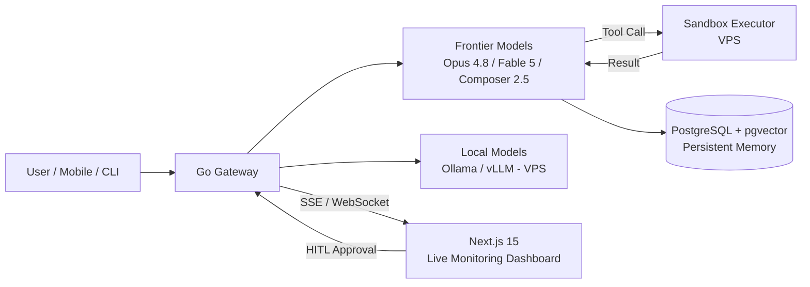

Traditional software development methodologies (Agile, Waterfall, etc.) are evolving into an **Agentic SDLC (Software Development Life Cycle)**, where AI agents autonomously take over writing code, debugging, and making architectural decisions.

This training equips participants with more than theoretical prompt engineering: a cumulative, scalable agent-development capability spanning mobile devices, terminal command lines, high-performance Go backend gateways, and Next.js-based live management dashboards.

## 1.1 Technology Integration Matrix

| Layer | Technology Stack | Role Inside the Agent |
| --- | --- | --- |
| Core Server | Go (Golang), PostgreSQL, pgvector | Highly concurrent tool execution, state management, and vector memory. |
| User Dashboard | Next.js 15, WebSockets / SSE | Multi-agent coordination monitoring, live log streams, and the HITL approval mechanism. |
| Mobile Client | iOS (Swift), Android (Kotlin) | Autonomous access to device hardware (camera, location, etc.) and Edge-AI synchronization. |
| System & CLI | Go CLI, SSH, Terminal TUI | System administration, autonomous VPS provisioning, and fast terminal-based command management. |
| Agent Brain | Composer 2.5, Claude Opus 4.8, Fable 5, Cursor IDE | High-level reasoning, planning, and autonomous code development loops. |
| Local Models | Ollama, vLLM, llama.cpp (GGUF), ONNX / CoreML | Self-hosted and on-device inference: privacy, cost control, and offline agents. |

## 1.2 System Architecture Flow

## 1.3 Model Stack & Local Model Operations

The curriculum is model-pluralist: agents are built against an abstraction layer so the brain can be swapped per task.

- **Composer 2.5** — fast agentic coding loops inside Cursor; the default editor-resident worker model
- **Claude Opus 4.8** — deep reasoning, architecture decisions, long-context review and judging (LLM-as-a-judge)
- **Fable 5** — long-horizon autonomous task execution and multi-agent orchestration roles
- **Local & open-weight models** — running quantized models (GGUF) with Ollama / llama.cpp, serving with vLLM on the VPS, on-device inference with CoreML / ONNX Runtime Mobile; choosing local vs. frontier per privacy, latency and cost budgets

## 1.4 Academic Mathematical Notation

The state transition function in an agent's decision tree is formulated as:

> **S(t+1) = f( S(t), A(t)(E) )**

Here *S(t)* represents the agent's current state, and *A(t)* represents the autonomous action (Action / Tool Execution) selected under the influence of the external environment *E*.

