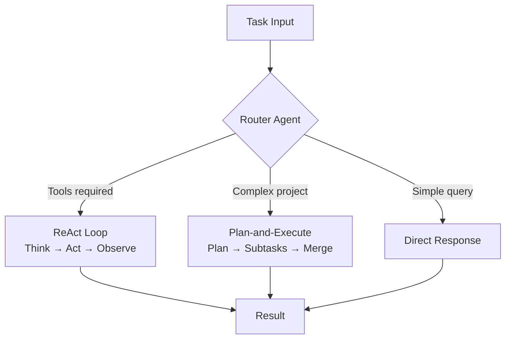

Optimizing `.cursorrules` in Cursor IDE and building "Agentic Development" conventions with Claude Opus 4.8. Planning agent topologies (Router, ReAct, Plan-and-Execute).

## Agent Topologies

## Learning Outcomes

- Mapping Agentic SDLC phases (intent, plan, execute, verify) onto the classic SDLC
- Defining per-project agent behavior contracts with `.cursorrules`
- Topology selection criteria: latency, cost, fault tolerance, auditability
