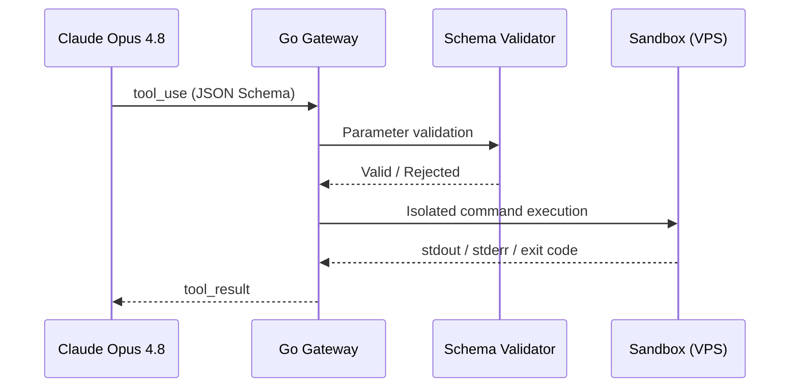

Agents interacting with the outside world. Defining functions to JSON Schema standards. Applying Model Context Protocol (MCP) standards. Autonomous file-system management and sandboxed command execution on a VPS.

## Tool Call Lifecycle

## Learning Outcomes

- Designing deterministic tool interfaces with JSON Schema
- Writing an MCP server and wiring existing MCP tools into the agent
- File-system and network isolation against sandbox escapes
