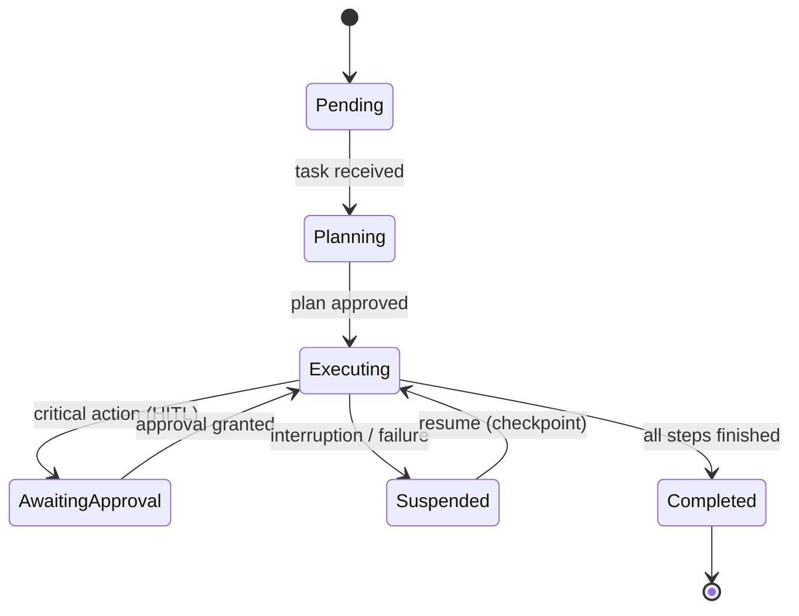

Integrating short-term memory (Session State) and long-term persistent memory (vector databases — pgvector). Designing a State Machine so an agent's interrupted decisions can autonomously **resume** from where they left off.

## Agent State Machine

## Learning Outcomes

- Designing checkpoint-based durable execution
- Semantic memory with pgvector: embedding, indexing, recall
- Managing the context budget between session memory and persistent memory
