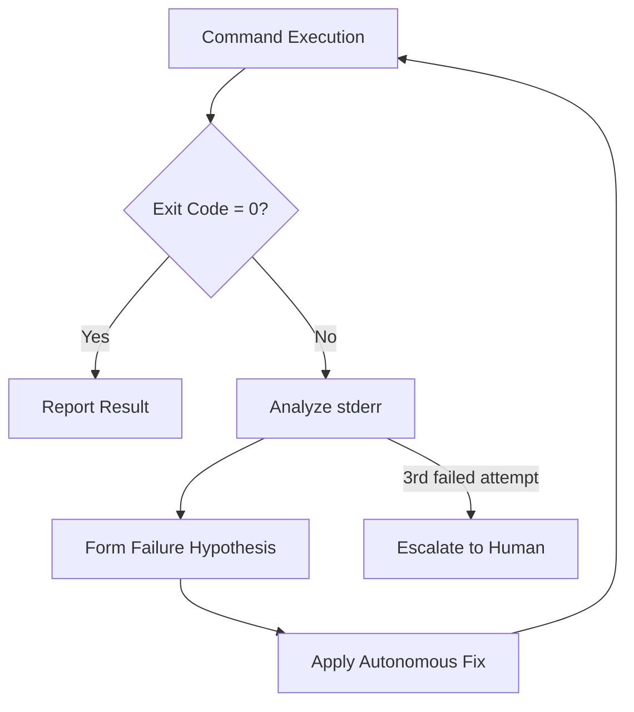

Measuring the quality of agent output (LLM-as-a-judge). On unexpected terminal errors, the agent reads its own error output and autonomously repairs itself (Self-Correction & Self-Healing loops).

## Self-Healing Loop

## Learning Outcomes

- LLM-as-a-judge rubrics and automated evaluation pipelines
- Collecting token / cost / latency telemetry with Go middleware
- Agent behavior test suites (golden traces) to catch regressions
