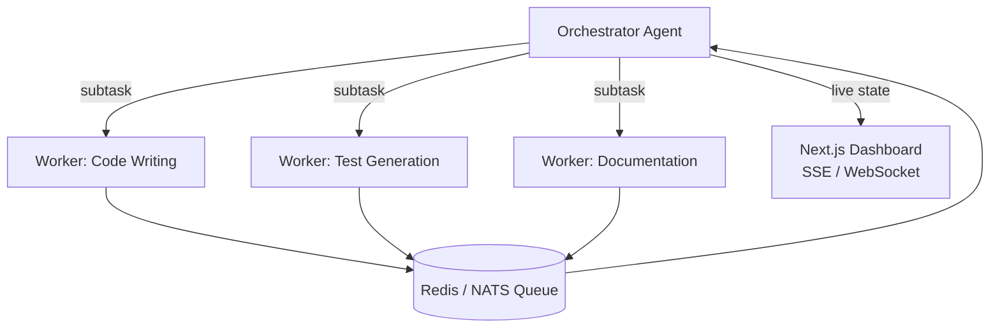

Orchestrator-Workers and Event-Driven (P2P) multi-agent coordination patterns. Synchronizing independently running agents using Go channels and queue systems (Redis, NATS).

## Orchestrator-Workers Pattern

## Learning Outcomes

- Task decomposition and result-reduction strategies
- Agent concurrency with Go goroutine + channel patterns
- Queue-based backpressure and agent scaling
