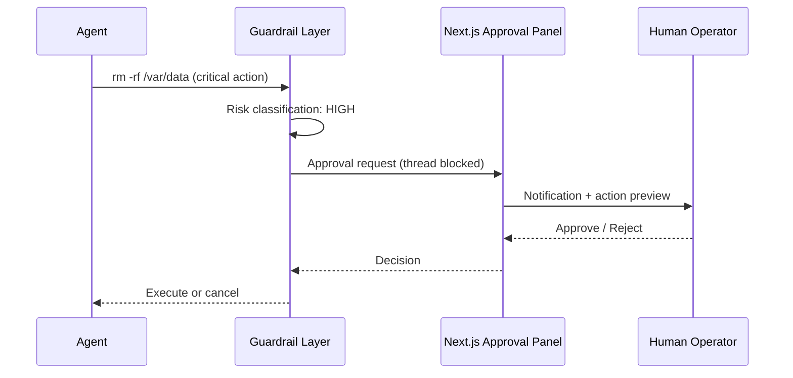

Input and output firewalls (Prompt Injection and PII leakage protections). Infinite-loop prevention mechanisms. Human approval interface integration for critical server commands (Human-in-the-Loop).

## HITL Approval Flow

## Learning Outcomes

- Input/output filters against prompt injection and PII leakage
- Loop counters, budget limits, and circuit breakers
- Signed action logs (audit trail) for accountability
