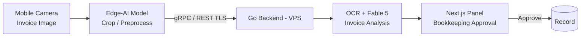

Extending AI agents into the mobile ecosystem widens the boundaries of autonomous systems. In this module, you will learn to build native mobile agent interfaces that access local device hardware (camera, sensors, local notifications).

## iOS Swift Integration

- Asynchronous LLM and Go API calls with the Swift async/await architecture
- Running lightweight on-device classification models (Edge AI) with Apple CoreML
- Synchronization agents running autonomously in the background with iOS Background Tasks

## Android Kotlin Integration

- Real-time data flows (SSE/WebSocket) with Kotlin Coroutines and Flow
- Agents performing autonomous memory optimization while the device is charging, via Android WorkManager
- On-device semantic vector computation with ONNX Runtime Mobile

## Hybrid Edge-Cloud Flow

> **Example Scenario:** The user uploads an invoice image from the mobile camera. The lightweight Edge-AI model on the device crops the invoice, the OCR / Fable 5 agent on the Go server analyzes it, and an automatic bookkeeping approval (HITL) is sent to the Next.js panel.
