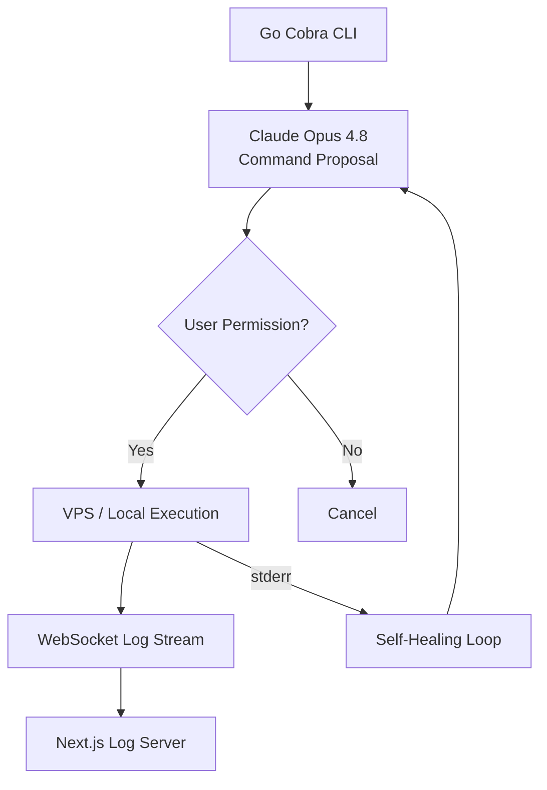

Automating the terminal — where software engineers spend most of their time — multiplies development speed. This module covers designing CLI agents that safely execute shell-level commands, run SSH automations, and are managed from the terminal.

## Terminal Agent Development Details

- **Go Cobra-CLI Integration:** Writing modern command-line tools in Go to run agents parametrically from the terminal
- **Interactive TUI (Terminal User Interface):** Managing agents' visual states in the terminal without a GUI, using Bubbletea / Charm libraries
- **VPS SSH & Cron Automation:** Autonomous agent scripts that perform periodic maintenance and analyze logs on VPS servers over SSH

## CLI Agent Command Flow

