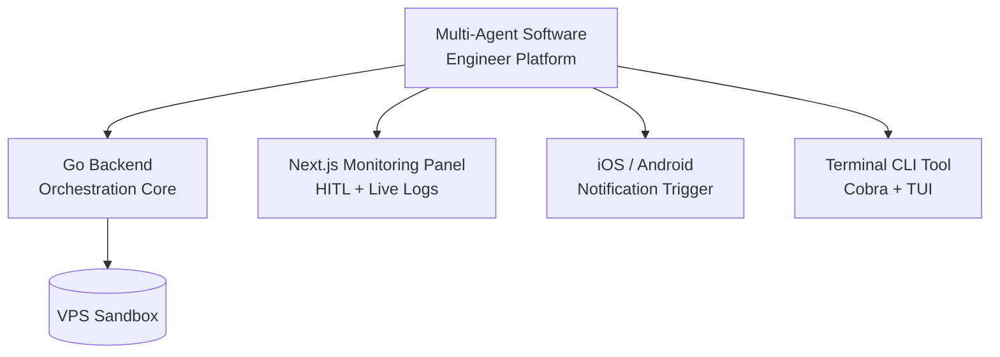

To earn graduation, participants must build a fully sandboxed, autonomous **"Multi-Agent Software Engineer Platform"** on a VPS — including a Go backend, a Next.js monitoring panel, an iOS/Android mobile notification trigger, and a terminal CLI tool — and present it live to a jury.

## Graduation Platform Components

## Evaluation Criteria

| Criterion | Description |
| --- | --- |
| Autonomy | Rate at which agents complete tasks without human intervention |
| Safety | Guardrail coverage, HITL accuracy, sandbox integrity |
| Observability | Quality of live logs, metrics, and cost telemetry |
| Architecture | Clarity of cross-layer contracts and scalability |
