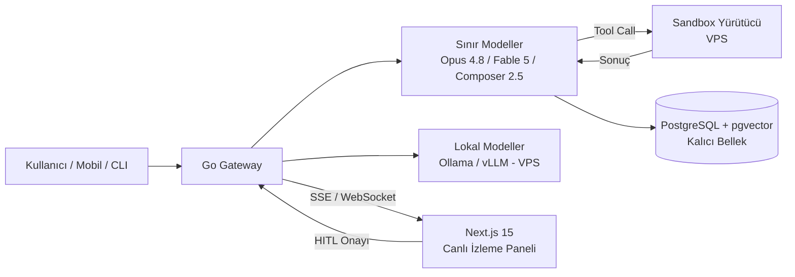

Geleneksel yazılım geliştirme metodolojileri (Agile, Waterfall vb.), yapay zeka ajanlarının kod yazma, hata ayıklama ve mimari kararlar alma süreçlerini otonom olarak üstlendiği **Agentic SDLC (Software Development Life Cycle)** yapısına evrilmektedir.

Bu eğitim, katılımcılara sadece teorik prompt mühendisliğini değil; mobil cihazlardan terminal komut satırlarına, yüksek performanslı Go backend ağ geçitlerinden (Gateway) Next.js tabanlı canlı yönetim panellerine uzanan kümülatif ve ölçeklenebilir bir ajan geliştirme yeteneği kazandırır.

## 1.1 Teknolojik Entegrasyon Matrisi

| Katman | Teknoloji Yığını | Ajan İçerisindeki Görevi |
| --- | --- | --- |
| Merkezi Sunucu | Go (Golang), PostgreSQL, pgvector | Yüksek eşzamanlı (concurrency) tool çalıştırma, state yönetimi ve vektörel bellek. |
| Kullanıcı Panel | Next.js 15, WebSockets / SSE | Çoklu ajan koordinasyon izleme paneli, canlı log akışları ve HITL onay mekanizması. |
| Mobil İstemci | iOS (Swift), Android (Kotlin) | Mobil cihaz donanımlarına (kamera, lokasyon vb.) otonom erişim ve Edge-AI senkronizasyonu. |
| Sistem & CLI | Go CLI, SSH, Terminal TUI | Sistem yönetimi, otonom VPS kurulumları ve hızlı terminal tabanlı komut yönetimi. |
| Ajan Beyni | Composer 2.5, Claude Opus 4.8, Fable 5, Cursor IDE | Üst düzey akıl yürütme (reasoning), planlama ve otonom kod geliştirme döngüleri. |
| Lokal Modeller | Ollama, vLLM, llama.cpp (GGUF), ONNX / CoreML | Self-host ve cihaz üstü çıkarım: gizlilik, maliyet kontrolü ve çevrimdışı ajanlar. |

## 1.2 Sistem Mimarisi Akışı

## 1.3 Model Yığını & Lokal Model Operasyonları

Müfredat model-çoğulcudur: ajanlar bir soyutlama katmanına karşı inşa edilir, böylece beyin görev başına değiştirilebilir.

- **Composer 2.5** — Cursor içinde hızlı agentic kodlama döngüleri; varsayılan editör-yerleşik worker modeli
- **Claude Opus 4.8** — derin muhakeme, mimari kararlar, uzun bağlam incelemesi ve değerlendirme (LLM-as-a-judge)
- **Fable 5** `badge:Geçiş Kapatıldı` — uzun ufuklu otonom görev yürütme ve çoklu ajan orkestrasyon rolleri; geçişi kullanıma kapatılmıştır ve yeni kullanım için artık erişime açık değildir
- **Lokal & açık ağırlıklı modeller** — Ollama / llama.cpp ile quantize modeller (GGUF) çalıştırma, VPS üzerinde vLLM ile servis etme, CoreML / ONNX Runtime Mobile ile cihaz üstü çıkarım; gizlilik, gecikme ve maliyet bütçelerine göre lokal/sınır model seçimi

## 1.4 Akademik Matematiksel Gösterim

Bir ajanın karar ağacındaki durum geçiş fonksiyonu şu şekilde formülize edilir:

> **S(t+1) = f( S(t), A(t)(E) )**

Burada *S(t)* ajanın mevcut durumunu (State), *A(t)* ise dış ortam etkisi *E* altında seçilen otonom aracı (Action / Tool Execution) temsil eder.
