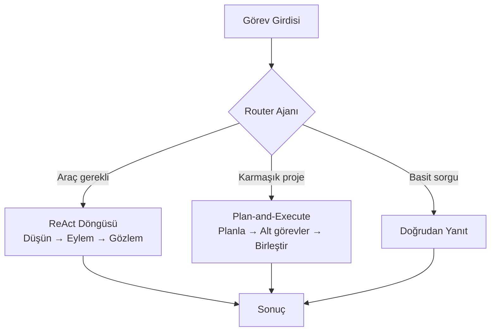

Cursor IDE üzerinde `.cursorrules` optimizasyonları ve Claude Opus 4.8 ile "Agentic Geliştirme" kurallarının inşası. Ajan topolojilerinin (Router, ReAct, Plan-and-Execute) planlanması.

## Ajan Topolojileri

## Öğrenme Çıktıları

- Agentic SDLC fazlarının (intent, plan, execute, verify) klasik SDLC ile eşlenmesi
- `.cursorrules` ile proje bazlı ajan davranış sözleşmeleri tanımlama
- Topoloji seçim kriterleri: gecikme, maliyet, hata toleransı, denetlenebilirlik
