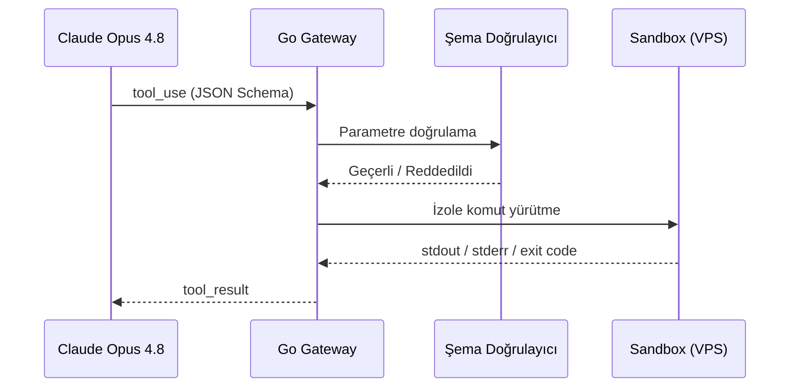

Ajanların dış dünya ile etkileşime girmesi. JSON Schema standartlarında fonksiyon tanımlama. Model Context Protocol (MCP) standartlarının uygulanması. VPS üzerinde otonom dosya sistemi yönetimi ve sandbox komut çalıştırma yetenekleri.

## Tool Çağrısı Yaşam Döngüsü

## Öğrenme Çıktıları

- JSON Schema ile deterministik tool arayüzleri tasarlama
- MCP sunucusu yazma ve mevcut MCP araçlarını ajana bağlama
- Sandbox kaçışlarına karşı dosya sistemi ve ağ izolasyonu
