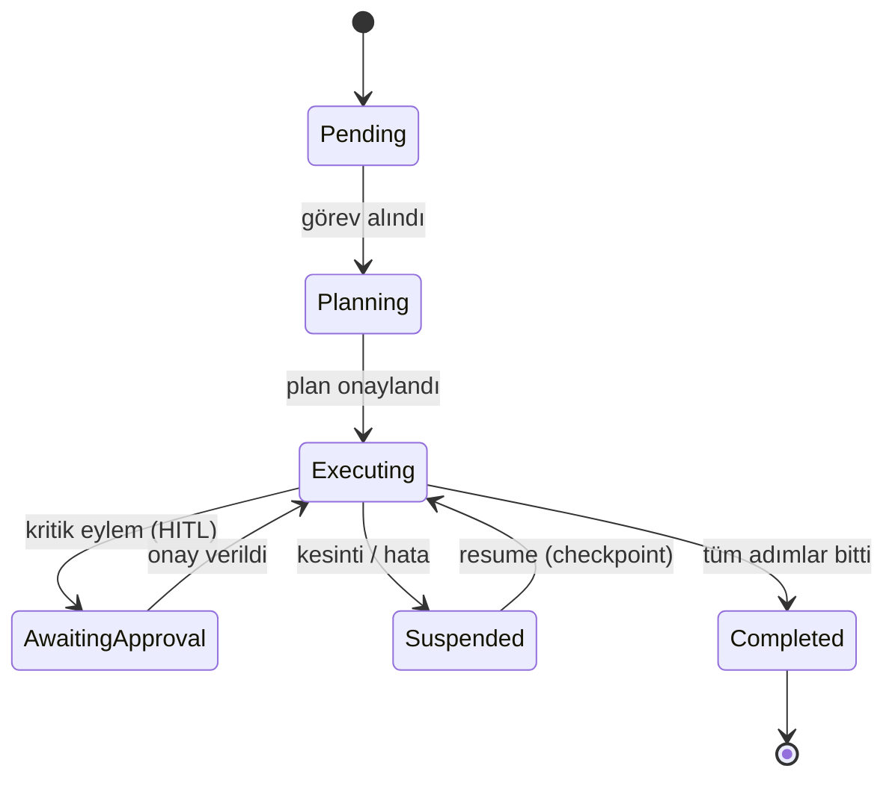

Kısa süreli bellek (Session State) ve uzun süreli kalıcı bellek (Vektör Veritabanları — pgvector) entegrasyonu. Ajan kararlarının yarıda kalması durumunda kaldığı yerden otonom olarak **Resume** edilmesi için State Machine tasarımı.

## Ajan Durum Makinesi

## Öğrenme Çıktıları

- Checkpoint tabanlı kalıcı yürütme (durable execution) tasarımı
- pgvector ile anlamsal bellek: embedding, indeksleme, geri çağırma
- Oturum belleği ile kalıcı bellek arasında bağlam bütçesi yönetimi
