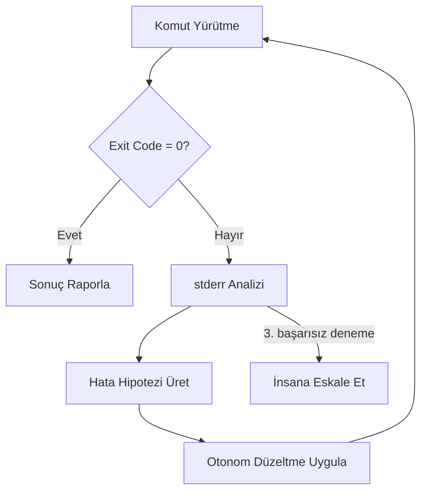

Ajan çıktılarının kalitesini ölçme (LLM-as-a-judge). Beklenmedik terminal hatalarında ajanın kendi hata çıktısını okuyarak otonom bir şekilde kendini onarması (Self-Correction & Self-Healing döngüleri).

## Self-Healing Döngüsü

## Öğrenme Çıktıları

- LLM-as-a-judge rubrikleri ve otomatik değerlendirme pipeline'ları
- Token / maliyet / gecikme telemetrisinin Go middleware ile toplanması
- Regresyon yakalamak için ajan davranış test setleri (golden traces)
