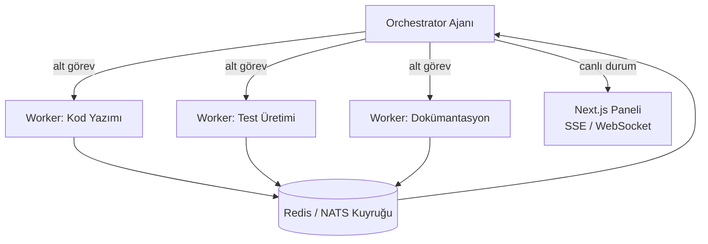

Orchestrator-Workers ve Event-Driven (P2P) çoklu ajan koordinasyon kalıpları. Go kanalları ve kuyruk sistemleri (Redis, NATS) kullanılarak bağımsız çalışan ajanların senkronize edilmesi.

## Orchestrator-Workers Kalıbı

## Öğrenme Çıktıları

- Görev ayrıştırma (decomposition) ve sonuç birleştirme (reduction) stratejileri
- Go goroutine + channel desenleri ile ajan eşzamanlılığı
- Kuyruk tabanlı backpressure ve ajan ölçeklendirme
