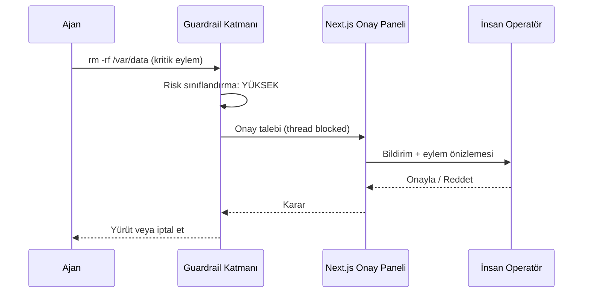

Giriş ve çıkış güvenlik duvarları (Prompt Injection ve PII sızıntı korumaları). Sonsuz döngü engelleme mekanizmaları. Kritik sunucu komutlarında insan onayı arayüzü entegrasyonu (Human-in-the-Loop).

## HITL Onay Akışı

## Öğrenme Çıktıları

- Prompt injection ve PII sızıntısına karşı giriş/çıkış filtreleri
- Döngü sayaçları, bütçe limitleri ve devre kesiciler (circuit breakers)
- Denetlenebilirlik için imzalı eylem logları (audit trail)
