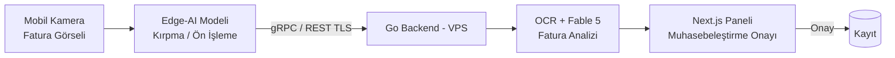

Yapay zeka ajanlarının mobil ekosisteme yayılması, otonom sistemlerin sınırlarını genişletir. Bu modülde, lokal mobil donanımlara (kamera, sensörler, lokal bildirimler) erişebilen yerel mobil ajan arayüzleri inşa edilmesini öğreneceksiniz.

## iOS Swift Entegrasyonu

- Swift async/await mimarisi ile asenkron LLM ve Go API çağrıları
- Apple CoreML ile cihaz üstünde (Edge AI) hafif sınıflandırma modellerinin çalıştırılması
- iOS Background Tasks ile arka planda otonom çalışan senkronizasyon ajanları

## Android Kotlin Entegrasyonu

- Kotlin Coroutines ve Flow yapıları ile gerçek zamanlı veri akışı (SSE/WebSocket)
- Android WorkManager ile cihaz şarja takılıyken otonom bellek optimizasyonu yapan ajanlar
- ONNX Runtime Mobile entegrasyonu ile cihaz içi anlamsal vektör hesaplamaları

## Hibrit Edge-Cloud Akışı

> **Örnek Senaryo:** Kullanıcı mobil kameradan fatura görseli yükler. Mobil cihazdaki hafif Edge-AI modeli faturayı kırpar, Go sunucusundaki OCR / Fable 5 ajanı faturayı analiz eder ve Next.js paneline otomatik muhasebeleştirme onayı (HITL) gönderir.
