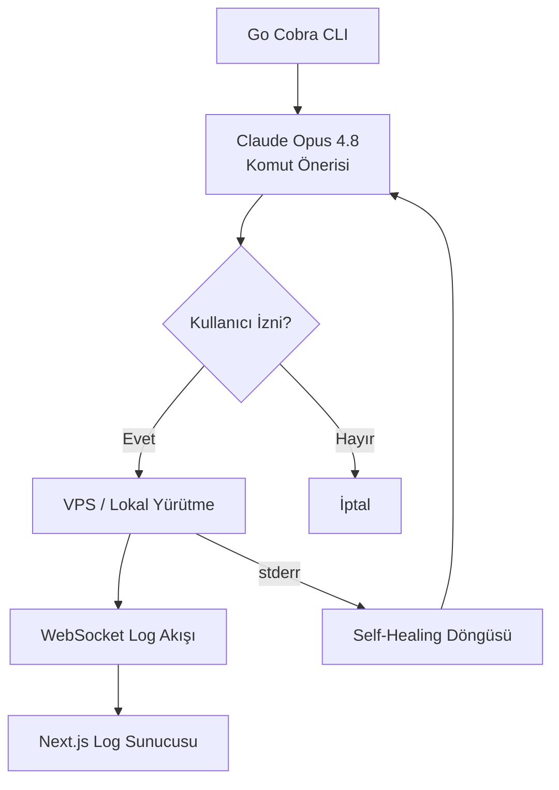

Yazılım mühendislerinin en çok vakit geçirdiği terminal ortamını otonomlaştırmak, geliştirme hızını katlar. Bu modül; kabuk (shell) seviyesinde güvenli komut çalıştıran, SSH otomasyonları yapan ve terminal üzerinden yönetilebilen CLI ajanlarının tasarlanmasını kapsar.

## Terminal Ajan Geliştirme Detayları

- **Go Cobra-CLI Entegrasyonu:** Go ile modern komut satırı araçları yazarak ajanları terminalden parametrik çalıştırma
- **Interactive TUI (Terminal User Interface):** Terminal üzerinde Bubbletea / Charm libraries kullanarak ajanların görsel state'lerini arayüzsüz yönetebilme
- **VPS SSH & Cron Automation:** SSH protokolü üzerinden VPS sunucularında periyodik bakım yapan, logları analiz eden otonom ajan betikleri

## CLI Ajan Komut Akışı

