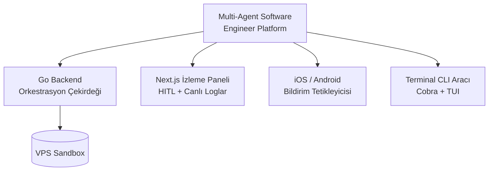

Katılımcıların mezuniyet hakkı kazanabilmesi için; Go backend, Next.js izleme paneli, iOS/Android mobil bildirim tetikleyicisi ve terminal CLI aracı içeren, VPS üzerinde tamamen sandbox edilmiş otonom bir **"Multi-Agent Software Engineer Platform"** geliştirmeleri ve bunu canlı olarak jüriye sunmaları gerekmektedir.

## Mezuniyet Platformu Bileşenleri

## Değerlendirme Kriterleri

| Kriter | Açıklama |
| --- | --- |
| Otonomi | Ajanların insan müdahalesi olmadan görev tamamlama oranı |
| Güvenlik | Guardrail kapsamı, HITL doğruluğu, sandbox bütünlüğü |
| Gözlemlenebilirlik | Canlı log, metrik ve maliyet telemetrisinin kalitesi |
| Mimari | Katmanlar arası sözleşmelerin netliği ve ölçeklenebilirlik |
